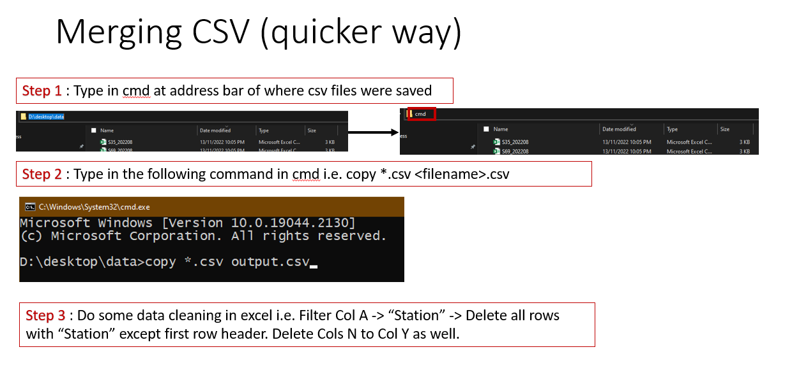
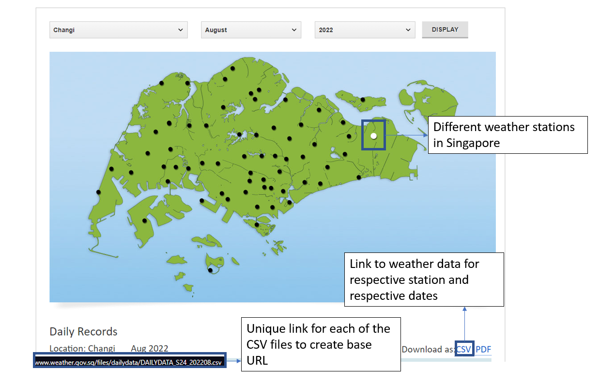

# Update
## Updated GUI Interface
- Loading bar added ✅
- Merging tool added ✅
- Auto create directory ✅
   

## Merging CSV
        copy *.csv <filename>.csv

# Old Method
## Summary
Scraping weather historical weather data from different weather stations from : [Weather.gov.sg](http://www.weather.gov.sg/climate-historical-daily/)

